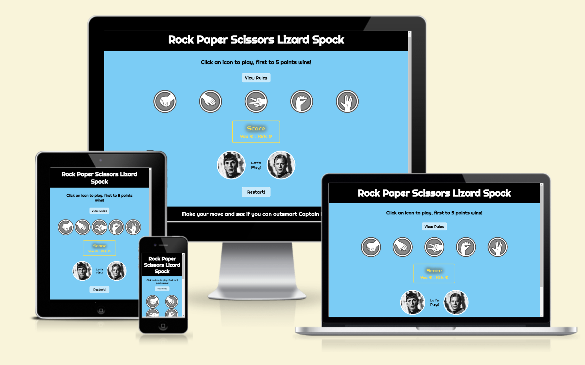
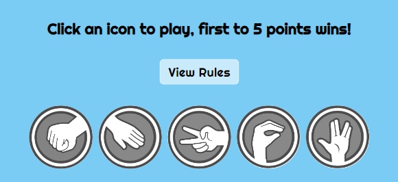
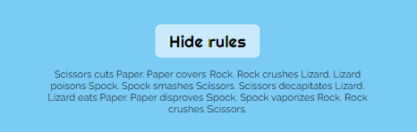
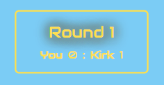

# Rock Paper Scissors Lizard Spock Game

The **Rock Paper Scissors Lizard Spock game** is a fun extension of the classic **Rock Paper Scissors** game, introducing two additionnal options with Lizard and Spock.

The project is designed to be a fun and interactive browser-based game, where the player competes against Capitain Kirk, the computer opponent.

The game is designed to offer entertainment for fans of the original game as well as for the enthusiasts of *The Big Bang Theory* where it became popular.
 
Just to mention that this version of the game was initially invented by *Sam Kass* before being mentioned on the TV show.

The game also showcases Javascript's ability to create dynamic, real-time games and responsive user interfaces.

## Features:

The game is packed with features that enhances user engagement, including dynamic scores updates, interactive rules and responsive design that works across different devices and screens sizes.

Here the key features:

### Existing Features:

- **Game Title and Header**
  - The game title is display at the top, the font-family and font-size have been chosen to set up the theme: users immediately know they are in for a fun twist on the classic game. The font-family and color scheme are inspired by the Star Trek universe, adding a thematic connection to the game's sci-fi roots.

  

- **Interactive game console**
  - The player is invited to choose from the 5 options: **Rock**, **Paper**, **Scissors**, **Lizard**, or **Spock** by clicking the corresponding icons. A feature highlights the icons when the mouse hovers over them. 

  

- **Rules Section**
  - The game includes a toggle button at the top of the console section, that hides or displays the rules. This feature ensures that players can quickly make their choice and learn the winning combinations. The toggle function enhances the overall user experience by decluttering the game area. When the rules are visible, the button prompts the player to hide the section again, ensuring a focused game interface.

  

- **Score section**
  - The game tracks the player's and Capitain Kirk's scores in real-time. It also tracks the round number. The first to reach 5 points is declared winner. 

  

- **Result display**
  - The result of each round is dynamically updated: the player's and computer's selection are reflected in the game console, making it easy to see who is winning each round. It also shows what rule applies and determines the winner. 
  For example, if you loose with "Paper covers Rock", it’s immediately displayed offering a clear feedback.

  

- **Restart Button**
  - A "Restart" button is available at any time to reset the game to its default state, allowing players to start again when the game is over or whenever they want to.

  

- **Footer**
  - The footer includes a fun nod to Captain Kirk as the computer opponent, reminding players to "Make your move and see if you can outsmart Captain Kirk." This playful twist adds a bit of humor and personality to the game, especially for fans of Star Trek.

### Features left to implement:

- **Multiplayer Mode**
  - A future update could allow two players to compete against each other instead of playing against the computer.

- **Score Persistence**
  - A feature that saves scores across sessions could be implemented so that users can keep track of their wins and losses.

## Testing:

The game has been tested to ensure that it works smoothly across different browsers and devices, including desktop and mobile screens. 

Here’s an overview of the testing process:

### Browser Compatibility:

The game has been tested and works well in the following browsers:
- Google Chrome
- Microsoft Edge
- Mozilla Firefox

### Responsive Design:

The game was tested on various screens sizes, including mobile devices, tablets, and desktops, ensuring a seamless experience.

### Bugs, Fixes and learning Experiences

- Recommendations from discussions with my mentor helped me improve my initial code:
  - I combined functions that I had initially created separately
  - I gave names to any functions that were anonymous.
  - I used constants to represent each selection (Rock, Paper, Scissors, Lizard, Spock) as string values. This approach prevented typos and ensured that each selection was always referred to consistently.  
  - He pointed out that the game was running indefinitely without an endpoint. To resolve this, I added a function that stops the game once either the player or the computer reaches 5 points, which also provides a clear winner.
- During development, I discovered through research that using an object to map each possible combination of the game (e.g., Rock crushes Scissors) was a more efficient approach than using multiple 'if-else' statements. This method significantly improved the code's readability and maintainability by avoiding deeply nested conditions.
- I also learned to improve the *documentation comments* for functions.

### Validator Testing

- **HTML**: No errors were found when passing the code through the [W3C Validator](https://validator.w3.org/).
- **CSS**: No errors were found when passing the stylesheet through the [Jigsaw Validator](https://jigsaw.w3.org/css-validator/).
- **JavaScript**: No major issues were detected through [JSHint](https://jshint.com/).
The following metrics were returned:
  - There are 10 functions in this file.
  - Function with the largest signature take 2 arguments, while the median is 0.
  - Largest function has 14 statements in it, while the median is 5.5.
  - The most complex function has a cyclomatic complexity value of 4 while the median is 2.5.

- **Lighthouse**: No major issues were detected.
    - Performance 82%.
    - Accessibility 91%.
    - Best practices 100%
    - SEO 91%

### Deployment Steps

The site was deployed to Github following the steps below:

1. Navigate to the repository on GitHub.
2. Click on the "Settings" tab.
3. Scroll down to the "GitHub Pages" section.
4. In the source dropdown menu, select the "main" branch and "Root" Folder.
5. Go back to the "Code" tab and refresh.
6. The ribbon at the top will display a green check when it has been deployed correctly.
7. On the "Deployment" section check the link for the deploid website.

The live link can be found here: https://sophiedufrane.github.io/project2-rockPaperScissors/

## Credits

- In the Javascrip file, the first function to wait for the DOM to finish loading before running the game came from the [Love Math Project](https://github.com/Code-Institute-Solutions/love-maths-2.0-sourcecode/tree/master) of the Code Institute (Author NielMc). This was adapted for the **Rock Paper Scissors Lizard Spock Game**. 

### Content

- The game mechanics and logic were inspired by the **Rock Paper Scissors Lizard Spock** variation from "The Big Bang Theory", initially invented by Sam Kass.
  
### Media

- Icons used for the game were sourced from [PNG Wing](https://www.pngwing.com/en/free-png-pzysy).
- The 2 pictures of Spock and Capitain Kirk were sourced from [Greg Dampier](https://www.gregdampier.com/comics/color/captain-kirk-spock-star-trek).